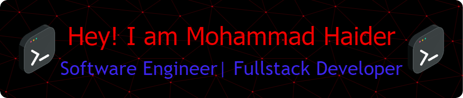

**` Mohammad Ariz Haider `**

I'm Mohamamd from New York, Im a software engineer, web developer for non-profit organizations, and a coding instructor teaching highschoolers web developement and software engineering. Join me in my quest to become a full stack engineer as I search for a full-time role while I create games, apps, and websites to showcase my skills.

- 🔭 I’m currently working on non-profit organizations as software developer 
- 🌱 I’m currently learning backend and IT 
- 💬 Ask me about Video games, anime, D&D 
- 📫 How to reach me: email: haidermo1408@gmail.com 
- ⚡ Fun fact: I play all games with keyboard and mouse

**`🧰 Languages and Tools`**
---
  
  
  
  
  
  
  
  

*`Socials`*

      

  

### 📊 Stats

